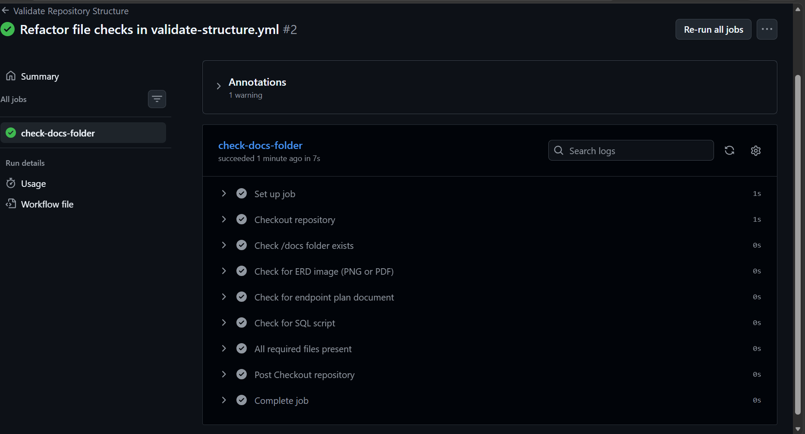

**Student:** Choeu Molepo
**Module:** PROG6212

# RaceDay

## System Description

RaceDay is a full-stack web-based event management system designed for the South African road running, walking, and cycling community. It replaces the paper-based registration, spreadsheets, and disconnected communication channels many community events currently rely on.The platform allows Event Organisers to create and manage events, categories, and
participant results, while Participants can browse upcoming events, enter
events by selecting a category, and track their personal performance history.

This repository contains **Part 1** of the project: system planning and
database design, including the Entity Relationship Diagram (ERD), the API
endpoint plan, and the SQL database script.

 ## Roles

**Event Organiser**
- Create, edit, and delete events
- Manage event categories
- Capture participant results
- View all enrolments for their events

**Participant**
- Create an account
- Browse upcoming events
- Enter an event by selecting a category
- View their own enrolments and track their personal results

## Technology Used

- SQL Server Management Studio (SSMS) - database design and scripting
- GitHub Actions - CI/CD workflow validation
- Markdown - documentation and endpoint planning

## Repository Structure
/docs
RaceDay_ERD.png - Entity Relationship Diagram
RaceDay_API_Endpoint_Plan (1).pdf - API endpoint plan
RaceDay_Schema.sql - Database creation script
RaceDay_SeedData.sql - Sample data seed script
cicd-success.png - CI/CD passing build screenshot
/.github/workflows
validate-structure.yml - CI/CD workflow validating /docs contents
README.md

## Design Notes

The `Events` table includes `Distance` and `EventType` fields, added after
cross-checking the Part 2 functional requirements, which specify that each
event must capture a distance and an event type (run, walk, or cycle). This
was a planned addition based on the brief's instruction to review all three
parts before finalising Part 1, not an unexplained deviation from the
original ERD.

## CI/CD

A GitHub Actions workflow validates that the `/docs` folder exists and
contains the required files (ERD image, endpoint plan document, and SQL
script) on every push to `main`.

## Video Walkthrough

An unlisted YouTube video walking through the planning documents, ERD
decisions, endpoint plan choices, and a live run of the SQL script in SSMS
can be found here:
**[Watch the video](YT link)**
